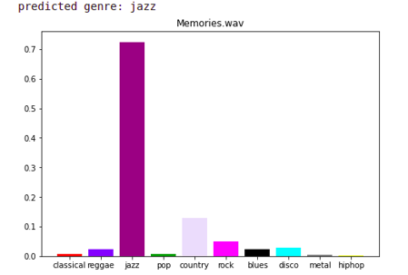
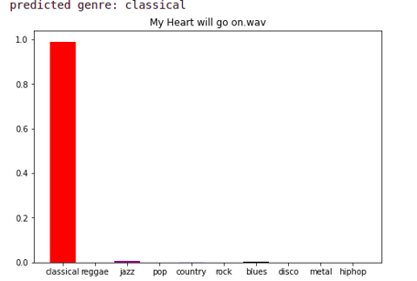

# Music-Genre-Classification
AI-powered Music Genre Recognition is the need of the hour with the booming music culture among the youth. With Music Streaming Apps like Spotify gaining massive popularity day by day, the use of AI for Music Recommendations in needed. The first step being accurate Genre Classification.
In this project, classification of Music into 10 popular genres is performed using Deep Learning.
The genres are Blues, Classical, Country, Disco, Hiphop, Jazz, Metal, Pop, Reggae and Rock.

## Approach
* Librosa library is used to load the audio data available and then Data Augmentation is performed by splitting the 30 second audio clips each into 10 parts. This is done to        ensure there is enough training data and no “Overfitting” takes place.
* Feature Extraction is performed using Mel-frequency Cepstrum (MFCCS) which converts the audio data into an array of extracted features on which Deep Learning model can be used for classification.
* A Deep Neural Network is designed. Relu and Sigmoid activation is used for Dense layers and finally softmax is used for the output layer to get the predicted probabilities for the samples.
## CNN based approach
* Librosa library can be used to create the Mel-Spectrogram for each of available audio files. Mel-Spectrogram is the image equivalent of the audio features encoded in the subject audio file.
* These images can be fed as inputs to the convolutional neural network followed by a few dense layers and a softmax layer to classify the images.
  
## Some Sample Results
### Memories (Maroon 5)
!
### My Heart Will Go On (Titanic)

